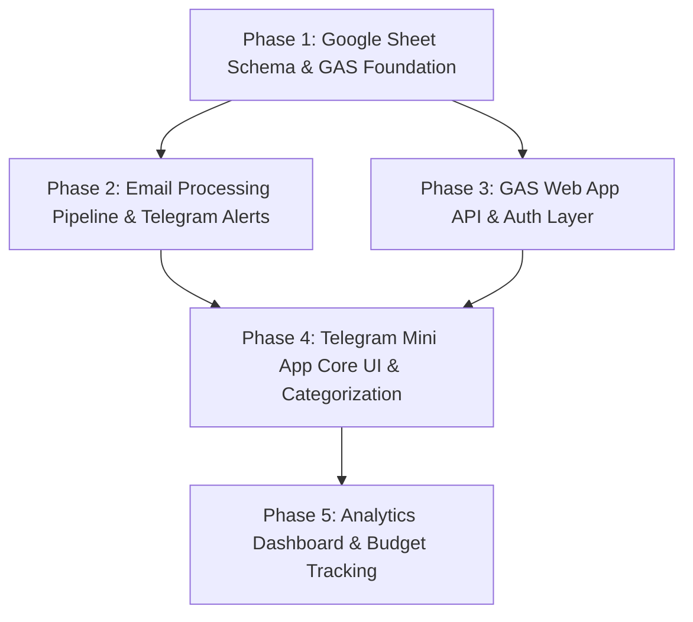

# Architecture Research: Spen Manager

> [!NOTE]
> This document defines the technical architecture, component boundaries, data flow, API design, Google Sheet schema, and implementation sequence for **Spen Manager** — a personal expense tracking system powered by Google Apps Script (GAS), Google Sheets, Telegram Bot API, and Telegram Mini App (Vite + React + TypeScript).

---

## 1. Executive Summary & Confidence Ratings

| Architectural Choice | Decision | Confidence Level | Rationale |
| :--- | :--- | :--- | :--- |
| **Backend & Database** | Google Apps Script (GAS) + Google Sheets | **HIGH (95%)** | Proven pattern from `save-manager` & `email-to-sheet`. Free tier, zero server maintenance, accessible data store. |
| **API Protocol** | Single `doPost` Action Dispatcher with `Content-Type: text/plain` | **HIGH (95%)** | Bypasses browser CORS preflight (`OPTIONS`) limitations inherent to GAS Web Apps. |
| **Authentication** | Telegram `initData` HMAC-SHA256 Verification | **HIGH (90%)** | Native Telegram WebApp security. Single-user mode checked against `ALLOWED_TELEGRAM_USER_ID`. |
| **Email Processing** | Provider-based Extractor + GAS Time Trigger | **HIGH (95%)** | Direct clone of proven `email-to-sheet` engine with Gmail Message ID deduplication and time budget safety. |
| **Frontend Stack** | Vite + React + TypeScript + `@telegram-apps/sdk-react` | **HIGH (90%)** | Industry standard for Telegram Mini Apps with modern developer experience and static GitHub Pages hosting. |
| **Frontend State** | TanStack Query (React Query) + Zustand | **HIGH (90%)** | Efficient server-state caching, automatic refetching, and optimistic updates for seamless transaction tagging. |

---

## 2. System Components & Boundaries

The architecture consists of **6 distinct component layers**. Each layer has strict boundaries and clear communication interfaces.

```mermaid
graph TD
    subgraph External Sources
        BankEmail["Bank Email (Timo)"]
    end

    subgraph Backend Services (Google Apps Script)
        Trigger["Time-based Trigger (5-15m)"]
        Pipeline["Email Pipeline Engine"]
        WebApp["GAS Web App (doPost / doGet)"]
        LockSvc["LockService (Concurrency)"]
        AuthSvc["Auth Service (HMAC verify)"]
    end

    subgraph Data Store
        SheetDB[("Google Sheet DB\n(Transactions, Categories,\nBudgets, Settings)")]
    end

    subgraph Telegram Platform
        BotAPI["Telegram Bot API"]
        TelegramClient["Telegram Mobile/Desktop Client"]
    end

    subgraph Frontend App (GitHub Pages)
        MiniApp["Telegram Mini App\n(Vite + React + TS)"]
        ReactQuery["TanStack Query (Cache)"]
    end

    %% Ingestion Flow
    BankEmail -->|Gmail Inbox| Pipeline
    Trigger -->|Execute periodically| Pipeline
    Pipeline -->|Read/Write Dedup & Rows| SheetDB
    Pipeline -->|Send New Tx Alert| BotAPI

    %% Telegram Interaction Flow
    BotAPI -->|Push Notification| TelegramClient
    TelegramClient -->|Launch WebApp| MiniApp

    %% Mini App API Flow
    MiniApp -->|Read/Mutate State| ReactQuery
    ReactQuery -->|HTTP POST + initData| WebApp
    WebApp -->|Validate HMAC| AuthSvc
    WebApp -->|Acquire Lock on Writes| LockSvc
    WebApp -->|CRUD Operations| SheetDB
```

### Component Breakdown

1. **Email Source (Gmail)**:
   - Receives transaction notification emails from banks (initial provider: Timo Bank).
   - Unread emails serve as the input queue for the ingestion engine.

2. **Email Pipeline Engine (GAS Background Worker)**:
   - **Boundary**: Triggered by GAS time-driven events (every 5–15 minutes).
   - **Responsibilities**: Searches Gmail (`is:unread label:timo`), parses email body/subject via regex extrators, checks duplicate `gmail_message_id` against Google Sheet, appends pending transactions (`status: UNCATEGORIZED`), marks emails as read, and sends a notification alert via Telegram Bot API.

3. **Google Sheet Database (Relational Sheets)**:
   - **Boundary**: Accessible only by GAS via `SpreadsheetApp` API.
   - **Responsibilities**: Acts as the single source of truth (SSOT). Contains structured sheets: `Transactions`, `Categories`, `Budgets`, and `Settings`.

4. **GAS Web App API Engine**:
   - **Boundary**: Exposes a public HTTPS endpoint (`doPost` / `doGet`) hosted on Google infrastructure.
   - **Responsibilities**: Receives JSON payloads from the Mini App frontend, validates Telegram `initData` signature, routes requests via action dispatchers (`get_transactions`, `categorize_transaction`, etc.), handles `LockService` for write operations, and formats JSON responses.

5. **Telegram Bot API**:
   - **Boundary**: External HTTPS API (`api.telegram.org`).
   - **Responsibilities**: Delivers transaction alert messages with inline keyboard buttons ("Categorize Now") that deep-link to the Telegram Mini App.

6. **Telegram Mini App Frontend (GitHub Pages SPA)**:
   - **Boundary**: Client-side single-page application hosted statically on GitHub Pages.
   - **Responsibilities**: Renders UI within Telegram WebApp container, syncs with Telegram theme colors, captures user inputs (assigning parent/child category & transaction type), and queries financial analytics dashboards.

---

## 3. Data Flow Architecture

### Flow 1: Automated Email Ingestion & Alerting
```
[Bank Email] -> (Gmail Inbox) 
              -> [GAS Time Trigger] 
              -> (Pipeline.gs: Search & Filter) 
              -> (TimoExtractor.gs: Regex Extract)
              -> (Sheet.gs: Dedup check against Transactions sheet)
              -> (Sheet.gs: Append Row [status=UNCATEGORIZED])
              -> (Telegram.gs: Send Notification to Telegram Chat)
```

### Flow 2: Mini App Launch & Authentication
```
[User] -> (Clicks 'Categorize' button in Telegram Chat)
       -> (Telegram opens WebApp URL on GitHub Pages with initData)
       -> [Mini App] initializes @telegram-apps/sdk-react
       -> [React App] issues POST request to GAS API with initData payload
       -> [GAS Web App] AuthService validates HMAC SHA-256 using BOT_TOKEN
       -> [GAS Web App] checks user ID === ALLOWED_TELEGRAM_USER_ID
       -> [GAS Web App] returns categories & pending transactions list
       -> [Mini App] renders transaction categorization UI
```

### Flow 3: Transaction Categorization (Optimistic Mutation Flow)
```
[User] -> (Selects Parent & Child Category, sets Type = EXPENSE)
       -> [Mini App] React Query updates UI state optimistically
       -> [Mini App] sends POST body: { action: "categorize_transaction", id: "tx_123", parent_id: "cat_food", child_id: "cat_coffee", type: "EXPENSE", initData: "..." }
       -> [GAS Web App] acquires LockService lock (timeout 10s)
       -> [GAS Web App] updates Google Sheet row [status=CATEGORIZED, updated_at=NOW]
       -> [GAS Web App] releases LockService lock
       -> [GAS Web App] returns updated transaction JSON
       -> [Mini App] confirms mutation success (or rolls back on failure)
```

---

## 4. Google Sheet Schema Design

To ensure data integrity, performance, and clear relationships, Google Sheet tabs act as database tables with strict column ordering and schema definitions.

### Table 1: `Transactions`
Stores incoming automated bank transactions and user-assigned categorizations.

| Column Letter | Field Name | Data Type | Key Type | Example / Description |
| :--- | :--- | :--- | :--- | :--- |
| **A** | `id` | `String` | **PK** | `tx_1722612345_a1b2` (Generated hash/UUID) |
| **B** | `transaction_date` | `ISO8601 String` | | `2026-08-02T14:30:00.000Z` |
| **C** | `amount` | `Number` | | `45000` (Always positive integer in VND) |
| **D** | `type` | `Enum` | | `EXPENSE` \| `INCOME` \| `TRANSFER` |
| **E** | `account` | `String` | | `Timo Spend` \| `Timo Goal` |
| **F** | `merchant_payee` | `String` | | `HIGHLANDS COFFEE` (Extracted merchant) |
| **G** | `raw_description` | `String` | | `Chuyen khoan den HIGHLANDS COFFEE...` |
| **H** | `parent_category_id` | `String` | **FK** | `cat_food_bev` (Null if uncategorized) |
| **I** | `child_category_id` | `String` | **FK** | `cat_coffee` (Null if uncategorized) |
| **J** | `status` | `Enum` | | `UNCATEGORIZED` \| `CATEGORIZED` \| `IGNORED` |
| **K** | `gmail_message_id` | `String` | **Unique Index**| `19118a7b6f2d9c4e` (Used for deduplication) |
| **L** | `created_at` | `ISO8601 String` | | `2026-08-02T14:31:02.000Z` |
| **M** | `updated_at` | `ISO8601 String` | | `2026-08-02T14:35:10.000Z` |

### Table 2: `Categories`
Maintains 2-level hierarchical categories (Parent -> Child).

| Column Letter | Field Name | Data Type | Key Type | Example / Description |
| :--- | :--- | :--- | :--- | :--- |
| **A** | `id` | `String` | **PK** | `cat_food_bev` (Parent) or `cat_coffee` (Child) |
| **B** | `parent_id` | `String` | **FK** | `NULL` (for Parent) or `cat_food_bev` (for Child) |
| **C** | `name` | `String` | | `Food & Beverage` or `Coffee & Tea` |
| **D** | `type` | `Enum` | | `EXPENSE` \| `INCOME` \| `TRANSFER` \| `BOTH` |
| **E** | `icon` | `String` | | `☕` or `🍔` (Emoji/Icon identifier) |
| **F** | `color` | `String` | | `#FF5733` (Hex color for UI charts) |
| **G** | `sort_order` | `Number` | | `10` (Ordering in UI lists) |
| **H** | `is_active` | `Boolean` | | `TRUE` \| `FALSE` |
| **I** | `created_at` | `ISO8601 String` | | `2026-08-02T00:00:00.000Z` |

### Table 3: `Budgets`
Defines monthly budget limits per category.

| Column Letter | Field Name | Data Type | Key Type | Example / Description |
| :--- | :--- | :--- | :--- | :--- |
| **A** | `id` | `String` | **PK** | `bdg_2026_08_food` |
| **B** | `category_id` | `String` | **FK** | `cat_food_bev` (Parent or Child category ID) |
| **C** | `monthly_limit` | `Number` | | `5000000` (VND limit per month) |
| **D** | `month_year` | `String` | | `2026-08` or `DEFAULT` |
| **E** | `created_at` | `ISO8601 String` | | `2026-08-01T00:00:00.000Z` |
| **F** | `updated_at` | `ISO8601 String` | | `2026-08-01T00:00:00.000Z` |

### Table 4: `Settings`
Key-Value configuration storage for script properties and state.

| Column Letter | Field Name | Data Type | Example / Description |
| :--- | :--- | :--- | :--- |
| **A** | `key` | `String` (PK) | `LAST_PIPELINE_RUN` \| `TELEGRAM_CHAT_ID` |
| **B** | `value` | `String` | `2026-08-02T23:00:00.000Z` \| `123456789` |
| **C** | `updated_at` | `ISO8601 String` | `2026-08-02T23:00:00.000Z` |

---

## 5. API Design & Concurrency Protection

### 5.1 Protocol & CORS Handling
Google Apps Script Web Apps redirect requests via 302/307 redirects to `script.googleusercontent.com`. Standard web browsers performing cross-origin `fetch` requests with headers such as `Content-Type: application/json` trigger CORS preflight (`OPTIONS` requests), which GAS Web Apps **do not support** and will return HTTP 405/403.

**Solution Pattern**:
- Frontend issue POST requests with `Content-Type: text/plain;charset=utf-8`.
- Backend parses body using `JSON.parse(e.postData.contents)`.
- Returns `ContentService.createTextOutput(JSON.stringify(response)).setMimeType(ContentService.MimeType.JSON)`.

### 5.2 Single POST Dispatcher Pattern (`doPost`)

Request Payload Structure:
```json
{
  "action": "categorize_transaction",
  "initData": "query_id=...&user=...&hash=...",
  "payload": {
    "transaction_id": "tx_1722612345_a1b2",
    "parent_category_id": "cat_food",
    "child_category_id": "cat_coffee",
    "type": "EXPENSE"
  }
}
```

Response Standard Envelope:
```json
{
  "status": "success",
  "data": { ... },
  "message": null,
  "timestamp": "2026-08-02T23:25:00.000Z"
}
```

### 5.3 Action Endpoint Catalog

| Action | HTTP Method | Concurrency Lock | Description |
| :--- | :--- | :--- | :--- |
| `get_transactions` | POST | No | Fetches transactions with filters (`status`, `month_year`, `limit`, `offset`). |
| `categorize_transaction` | POST | **Yes (LockService)** | Updates category & type for a transaction. |
| `get_categories` | POST | No | Retrieves full 2-level category tree. |
| `upsert_category` | POST | **Yes (LockService)** | Creates or updates a parent/child category. |
| `get_dashboard` | POST | No | Calculates monthly analytics (category breakdown, expense vs income, top merchants, budget consumption). |
| `set_budget` | POST | **Yes (LockService)** | Sets or updates monthly budget limit for a category. |

### 5.4 Concurrency Safety Guard (`handleWriteWithLock`)
All write operations (`categorize_transaction`, `upsert_category`, `set_budget`) must be wrapped with `LockService.getScriptLock()` (10-second timeout) to prevent spreadsheet row corruption when multiple requests occur simultaneously.

---

## 6. Telegram Mini App Integration Lifecycle

### 6.1 SDK Architecture (`@telegram-apps/sdk-react`)
The frontend uses `@telegram-apps/sdk-react` to integrate with Telegram's WebApp environment.

```tsx
// main.tsx entry setup pattern
import { SDKProvider } from '@telegram-apps/sdk-react';
import { QueryClient, QueryClientProvider } from '@tanstack/react-query';

const queryClient = new QueryClient({
  defaultOptions: {
    queries: {
      staleTime: 1000 * 60 * 5, // 5 minutes cache
      refetchOnWindowFocus: false,
    },
  },
});

ReactDOM.createRoot(document.getElementById('root')!).render(
  <SDKProvider acceptCustomStyles>
    <QueryClientProvider client={queryClient}>
      <App />
    </QueryClientProvider>
  </SDKProvider>
);
```

### 6.2 Development Environment Mocking
During local browser development (`npm run dev`), Telegram WebApp SDK parameters (`initData`, theme) are unavailable. A mock provider injects mock `initData` and theme variables when running outside the Telegram iframe:

```typescript
// utils/mockEnv.ts
import { mockTelegramEnv } from '@telegram-apps/sdk-react';

if (import.meta.env.DEV) {
  mockTelegramEnv({
    themeParams: {
      bgColor: '#ffffff',
      textColor: '#000000',
      buttonColor: '#2481cc',
      buttonTextColor: '#ffffff',
    },
    initData: {
      user: { id: 123456789, firstName: 'Dev', lastName: 'User' },
      hash: 'mock_hash',
      authDate: new Date(),
    },
  });
}
```

---

## 7. Email Parsing Pipeline Architecture

The email parsing pipeline clones the extensible architecture from `email-to-sheet`.

```
Pipeline_
  ├── Config_ (Loads search query, quiet hours, credentials)
  ├── State_ (LockService, last run state)
  ├── ExtractorFactory (Provider selector: Timo, VCB, etc.)
  │     └── TimoExtractor (Regex rules for Timo emails)
  ├── Gmail_ (Search threads, extract body, mark read)
  ├── Sheet_ (Dedup check, format row, batch append)
  └── Telegram_ (Send format message with WebApp button)
```

### Key Safety Mechanisms:
1. **Gmail Message ID Deduplication**: Before writing rows, the pipeline fetches all existing `gmail_message_id` entries from Google Sheet into a Set lookup (`Sheet_.getExistingIds()`).
2. **Time-Budget Management**: GAS enforces a hard 6-minute execution limit. The pipeline monitors `Date.now() - startTime` and gracefully terminates if elapsed time exceeds 5 minutes (`300000ms`).
3. **Quiet Hours Guard**: Allows suppressing automated Telegram notifications during night hours (e.g. `23:00-07:00`) while still storing transactions in the Sheet.

---

## 8. Frontend State Management & UI Architecture

### 8.1 State Division

```
                     ┌─────────────────────────────────────────┐
                     │          Spen Manager Frontend          │
                     └────────────────────┬────────────────────┘
                                          │
                  ┌───────────────────────┴───────────────────────┐
                  ▼                                               ▼
      ┌───────────────────────┐                       ┌───────────────────────┐
      │   Server State        │                       │    UI Local State     │
      │  (TanStack Query)     │                       │  (Zustand / Context)  │
      └───────────┬───────────┘                       └───────────┬───────────┘
                  │                                               │
    ┌─────────────┴─────────────┐                   ┌─────────────┴─────────────┐
    │ - Pending Transactions    │                   │ - Active Tab Selection    │
    │ - Category Hierarchy      │                   │ - Date Range Filter       │
    │ - Dashboard Analytics     │                   │ - Categorize Modal State  │
    │ - Budget Limits           │                   │ - Theme Preference        │
    └───────────────────────────┘                   └───────────────────────────┘
```

### 8.2 Optimistic Updates for Categorization
When a user categorizes a transaction in the Mini App, TanStack Query immediately updates the cache before the API response completes:

```typescript
const queryClient = useQueryClient();

const categorizeMutation = useMutation({
  mutationFn: (params: CategorizeParams) => apiCall('categorize_transaction', params),
  onMutate: async (newTx) => {
    await queryClient.cancelQueries({ queryKey: ['transactions'] });
    const previousTxList = queryClient.getQueryData(['transactions']);

    // Optimistically remove from pending list or update status
    queryClient.setQueryData(['transactions'], (old: Transaction[] = []) =>
      old.map((tx) =>
        tx.id === newTx.transaction_id
          ? { ...tx, status: 'CATEGORIZED', parent_category_id: newTx.parent_category_id }
          : tx
      )
    );

    return { previousTxList };
  },
  onError: (err, newTx, context) => {
    // Rollback cache if network/backend fails
    if (context?.previousTxList) {
      queryClient.setQueryData(['transactions'], context.previousTxList);
    }
  },
  onSettled: () => {
    queryClient.invalidateQueries({ queryKey: ['transactions'] });
    queryClient.invalidateQueries({ queryKey: ['dashboard'] });
  },
});
```

---

## 9. Build Order & Implementation Plan

Based on component dependencies, the system must be built in 5 sequential phases:



### Phase Breakdown

1. **Phase 1: Google Sheet Schema & Backend Infrastructure**:
   - Create Google Sheet workbook structure with standard column formats (`Transactions`, `Categories`, `Budgets`, `Settings`).
   - Populate initial seed categories (2-level: Food, Transport, Housing, Salary, etc.).
   - Set up Apps Script project with `clasp` for local development.

2. **Phase 2: Email Pipeline & Telegram Alerting**:
   - Port `Pipeline.gs`, `Gmail.gs`, `Sheet.gs`, `State.gs`, and `LockService` from `email-to-sheet`.
   - Implement `TimoExtractor.gs` with regex parsing for Timo transaction emails.
   - Implement `Telegram.gs` bot notification dispatcher with direct WebApp open button.
   - Configure 10-minute GAS time-based trigger.

3. **Phase 3: GAS REST API & Authentication**:
   - Implement `doPost` dispatcher in `Code.js`.
   - Implement `AuthService.js` to validate Telegram WebApp `initData` HMAC SHA-256 signatures.
   - Implement read/write repository methods (`TransactionRepository`, `CategoryRepository`).

4. **Phase 4: Telegram Mini App Core UI**:
   - Initialize Vite + React + TypeScript + Tailwind CSS / Telegram UI package.
   - Integrate `@telegram-apps/sdk-react` and local mock environment.
   - Implement `callBackendApi` text/plain POST helper.
   - Build **Pending Transactions List** and **2-Level Category Picker Modal** with optimistic updates.
   - Deploy frontend SPA to GitHub Pages via GitHub Actions.

5. **Phase 5: Analytics Dashboard & Budget Tracking**:
   - Implement `get_dashboard` action in backend (monthly totals, parent breakdown, top merchants).
   - Build **Dashboard UI** in Mini App with pie charts (Recharts or Chart.js) and trend bars.
   - Implement **Budget Management UI** and progress bars per category.

---

## 10. Sources & References

1. **Prior Art Repositories**:
   - [`save-manager`](file:///home/dangnd/code/github/save-manager): Referencing `backend/Code.js` for `doPost` routing & `initData` verification; `frontend/src/api.ts` for text/plain CORS preflight workaround.
   - [`email-to-sheet`](file:///home/dangnd/code/github/email-to-sheet): Referencing `src/Pipeline.gs` for email fetch, dedup, lock service, time budget safety, and Telegram notifications.
2. **Telegram Mini Apps Documentation**:
   - Official Telegram Mini App Docs: [https://core.telegram.org/bots/webapps](https://core.telegram.org/bots/webapps)
   - `@telegram-apps/sdk` & `@telegram-apps/sdk-react` Libraries: [https://docs.telegram-mini-apps.com/](https://docs.telegram-mini-apps.com/)
3. **Google Apps Script Documentation**:
   - Web Apps & ContentService: [https://developers.google.com/apps-script/guides/html/communication](https://developers.google.com/apps-script/guides/html/communication)
   - LockService Concurrency: [https://developers.google.com/apps-script/reference/lock/lock-service](https://developers.google.com/apps-script/reference/lock/lock-service)
