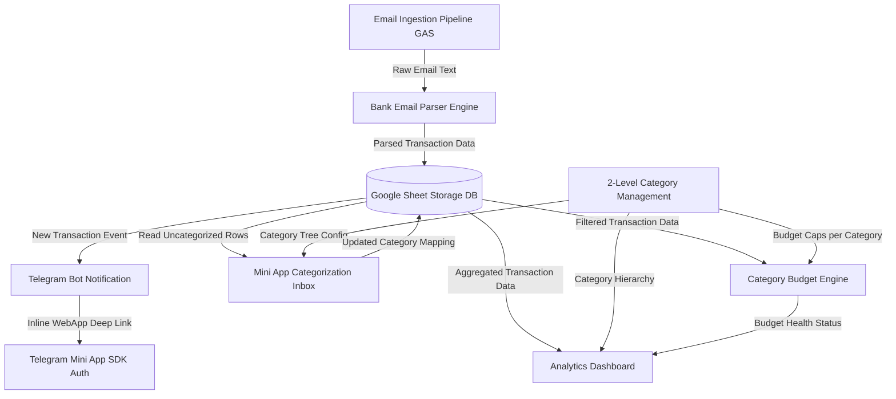

# Features Research: Spen Manager

## Table Stakes

Table stakes are the baseline features required for any personal expense tracking application to be viable and useful. Without these features, users cannot reliably manage their finances or gain meaningful insights into their spending habits.

### 1. Automated Transaction Ingestion & Email Parsing
- **Bank Email Parsing Engine**: Automatic extraction of key metadata (amount, timestamp, payee/merchant name, transaction direction/type, account reference) from incoming bank emails (starting with Timo Bank). Uses deterministic regex/template rules.
- **Unparsed/Failed Queue**: Graceful handling of unparseable emails or unknown notification formats by flagging them into an unassigned queue rather than dropping transactions.
- **Transaction Types Handling**: Explicit classification into 3 standard financial types:
  - **Expense (Chi)**: Outgoing spending to merchants, services, or individuals.
  - **Income (Thu)**: Incoming salary, refunds, or received payments.
  - **Transfer (Chuyển khoản)**: Internal account transfers or non-expense movements (e.g. credit card bill repayment, moving funds to savings).

### 2. 2-Level Hierarchical Category System
- **Parent / Child Structure**: Support for high-level grouping (Parent Category) and granular tracking (Child Subcategory).
  - *Example*: `Food & Dining` (Parent) $\rightarrow$ `Breakfast`, `Coffee`, `Groceries` (Children).
- **Category Management (CRUD)**: Mini App interface to create, rename, and organize parent categories and their child subcategories.
- **Transaction Categorization Inbox**: Rapid classification UI inside the Mini App allowing users to assign uncategorized bank transactions to specific subcategories.

### 3. Category Budget Tracking
- **Category-Level Monthly Limits**: Ability to set target budget caps per parent or child category for each calendar month.
- **Budget Health Indicators**: Real-time visual progress tracking (percentage spent vs. limit) with color-coded status thresholds:
  - **Normal (<80%)**: Green / neutral indicator.
  - **Warning (80%–100%)**: Yellow / warning indicator.
  - **Exceeded (>100%)**: Red / alert indicator.
- **Budget vs. Actual Variance**: Simple numerical display showing remaining budget balance or overspending amount.

### 4. Visual Analytics Dashboard
- **Financial Overview KPIs**: Summary metrics for current month: Total Income, Total Expenses, Net Cash Flow (`Income - Expense`), and Pending Uncategorized count.
- **Category Breakdown Chart (Pie / Donut)**: Visual distribution of spending across parent categories with drill-down capability into child subcategories.
- **Monthly Spending Trend Chart (Bar / Line)**: Multi-month historical spending trends with month-over-month (MoM) comparative analysis.
- **Top Merchants / Payees List**: Ranked list of top spending destinations to highlight major expenditure drivers.

### 5. Telegram Integration & Notifications
- **Real-Time Transaction Push**: Immediate Telegram message sent to the user upon parsing a new bank email notification.
- **Direct Mini App Deep Linking**: Inline Telegram button (`Open Spen Manager`) attached to the notification for 1-tap navigation directly to the uncategorized transaction inbox.
- **Native Telegram UX Sync**: Automatic adoption of Telegram's color palette (dark/light mode) via Telegram WebApp SDK API.

---

## Differentiators

Differentiators are features that provide competitive advantage and unique user value compared to traditional standalone mobile apps (e.g., Money Lover, Toshl, Spendee, YNAB).

### 1. Zero-Friction Automated Capture Without Bank API Subscriptions
- **No Manual Entry Friction**: Captures 100% of card/account spending automatically without requiring the user to open the app or type amounts manually after every purchase.
- **No Paid Open Banking Aggregators**: Bypasses costly, fragile third-party bank scraping services (Plaid, Salt Edge, Yodlee) by relying on free, reliable bank email notifications.
- **Full Privacy & Self-Hosted Ownership**: Data is stored directly in the user's personal Google Sheet via Google Apps Script (GAS). Zero third-party cloud database dependency or vendor lock-in.

### 2. Messenger-Native Micro-Workflow (Telegram Mini App)
- **Zero App Installation**: Instant accessibility inside Telegram (desktop, web, iOS, Android) without downloading standalone native apps or managing separate app updates.
- **Contextual Notification-to-Categorization Flow**: Notification arrives in Telegram $\rightarrow$ user taps button $\rightarrow$ Mini App opens inline $\rightarrow$ single-tap categorization $\rightarrow$ dismiss. The entire loop takes under 5 seconds.

### 3. Smart Transfer & Non-Expense Isolation
- **Accurate Net Spend Calculation**: Explicitly segregates transfers (credit card payment, savings transfer) from actual consumption expenses. Prevents double-counting expenses (e.g., paying a credit card bill with cash already logged as individual purchases).

---

## Anti-Features

Anti-features are capabilities deliberately **excluded** from the scope of Spen Manager. Building these features would add unnecessary complexity, increase maintenance overhead, or undermine the core value proposition of an automated, lightweight, zero-cost personal app.

| Anti-Feature | Why Deliberately Omitted | Alternative / Strategy |
| :--- | :--- | :--- |
| **Manual Transaction Entry** *(v1 Scope)* | The core goal is 100% automated email capture. Adding complex manual entry forms in v1 bloats the UI and distracts from bank automation. | Rely exclusively on automated email ingestion. (May re-evaluate in future iterations if cash expenses become required). |
| **Raw Transaction Editing / Deletion** | Bank email data (amount, timestamp, merchant) represents immutable audit truth. Modifying raw fields can cause data corruption between Sheet and Bank. | Allow updating category assignment and custom notes, but keep raw parsed bank fields immutable. |
| **AI / LLM Auto-Categorization** | Third-party LLM APIs (OpenAI/Anthropic) introduce recurring costs, latency, non-deterministic output, and security risks. User prefers 100% manual control over category assignment. | Deterministic user categorization via fast 1-tap Mini App inbox. Fast, free, and 100% accurate. |
| **Multi-User / Shared Household Wallets** | Introduces multi-tenant schema overhead, user authentication, permissions management, and complex state synchronization. | Strictly single-user execution scope tied to the owner's Telegram User ID. |
| **Multi-Currency & Live Exchange Rates** | Adds API dependencies, currency conversion math, and FX rate caching overhead for single-country bank usage (VND / Timo). | Assume single local currency (VND) across all calculations and reporting. |
| **Native Mobile App (iOS / Android)** | Requires app store approvals, cross-platform build pipelines, native mobile SDK maintenance, and complex app deployment. | Telegram Mini App (Vite + React + TS) deployed on GitHub Pages. Lightweight and multi-platform by default. |

---

## Feature Dependencies

The graph and table below detail how core components depend on underlying data pipelines and prerequisite features.

### Dependency Matrix

| Target Feature | Depends On (Prerequisites) | Rationale |
| :--- | :--- | :--- |
| **Bank Email Parser Engine** | Email Ingestion Pipeline (Gmail API / GAS) | Must fetch raw email text before parsing. |
| **Google Sheet Storage (DB)** | Bank Email Parser Engine | Needs structured JSON/dictionary output to write rows. |
| **Telegram Bot Notification** | Google Sheet Storage (DB) | Triggered post-ingestion to notify user with transaction details. |
| **Mini App Categorization Inbox** | Google Sheet Storage, Telegram Mini App Auth, 2-Level Category Tree | Requires reading uncategorized transactions and active category structure to assign subcategories. |
| **Category Budget Tracking** | 2-Level Category Tree, Google Sheet Storage | Requires category limits and categorized spend data to calculate usage percentages. |
| **Analytics Dashboard Charts** | Categorized Transactions in Google Sheet, Category Tree | Needs categorized, time-stamped transaction records to render pie/bar/line charts and KPI summaries. |

---

## Complexity Estimates

Estimates reflect technical risk, implementation effort, and component interactions within the selected tech stack (Google Apps Script, Google Sheets, Vite + React + TypeScript, Telegram WebApp API).

| Feature Component | Technical Stack | Complexity Rating | Effort (T-Shirt Size) | Implementation Risk & Technical Considerations |
| :--- | :--- | :---: | :---: | :--- |
| **Bank Email Parsing Pipeline** | Google Apps Script (GAS) + Gmail API + Regex | **Medium** | **M** | Email template changes by bank (Timo); edge-case parsing (transfer vs expense keywords, foreign currency notes in emails). |
| **Google Sheet Storage & DB Layer** | GAS + Google Sheets API | **Low** | **S** | Simple row append and sheet querying. Low risk, proven pattern from `email-to-sheet`. |
| **Telegram Notification & Deep Link** | Telegram Bot API (`sendMessage`) | **Low** | **S** | Straightforward HTTP POST call to Telegram Bot API with inline WebApp button. |
| **2-Level Category Management** | React + TypeScript + GAS API | **Low-Medium** | **M** | Managing parent-child relational state in a Google Sheet backend; preventing orphaned child categories. |
| **Mini App Categorization Inbox** | React + TypeScript + Telegram SDK | **Medium** | **M** | Optimistic UI updates, batch classification performance over GAS API, touch-friendly UI design. |
| **Category Budget Engine** | GAS Aggregations + React State | **Medium** | **M** | Date range math (calendar month reset), handling month roll-overs, computing parent budget rollups. |
| **Analytics Dashboard & Visual Charts** | React + Recharts / Chart.js | **High** | **L** | Aggregating raw Sheet data into chart-ready formats; rendering responsive pie/bar/line charts within Telegram Webview boundaries. |
| **Telegram WebApp SDK & Theme Sync** | Telegram WebApp JS SDK + CSS Variables | **Low** | **S** | Initializing Telegram WebApp context, extracting Telegram theme variables for seamless dark/light adaptation. |

---

## Sources

1. **Internal Codebases & Architecture**:
   - `email-to-sheet`: Reference implementation for Google Apps Script Gmail fetching, regex email parsing, and Google Sheet logging.
   - `save-manager`: Reference implementation for GAS backend integration with Vite + React + TypeScript Telegram Mini App.
2. **Industry Product Research & Standards**:
   - *YNAB (You Need A Budget)*: Category budgeting methodology (envelope budgeting), parent/child category rollup structures.
   - *Toshl Finance / Spendee / Monefy*: Expense tracking UX patterns, 2-level category standards, pie chart drill-downs.
   - *Telegram Mini Apps Documentation*: [Telegram WebApp API Guides](https://core.telegram.org/bots/webapps) — Theme parameters, viewport handling, and inline button integration.
3. **Domain Best Practices**:
   - *Personal Finance Data Modeling*: Relational mapping between transactions, subcategories, parent categories, and budget limits.
   - *Zero-Friction Transaction Tracking*: Industry user research demonstrating that friction in logging (>5 seconds) is the primary driver of expense tracker app abandonment.
